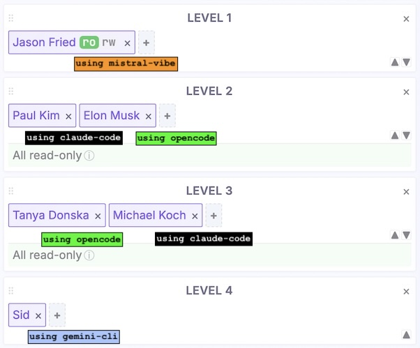
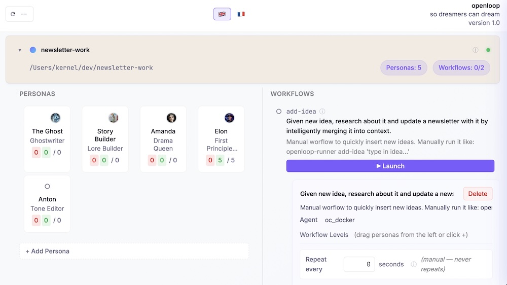

Onboard your ai team.

Openloop is your ai agent orchestrator to build repeateable workflows and create ai teammates to work on them.
You may combine different agents like claude-code and opencode to work on a single task together or mix multiple claude-code subscriptions.


## Example workflow

You build your own workflows. Here is an example flow I use a lot for end-to-end predictable feature development:

| | |
|:---:|---|
| Implement *smth* ... | Your prompt |
|  | Each level represents a stage in the pipeline:<br>— [Jason](https://world.hey.com/jason) is a creative director persona that expands input prompt into unique feature description<br>- `Paul` and `Elon` are 2 analysts that ground [Jason's](https://world.hey.com/jason) thoughts to something that would be reasonable to build<br>- [Tanya](https://dnsk.work/blog) and `Mike` come up with specs based on `Paul's` and `Elon's`. [Tanya](https://dnsk.work/blog) (UIX) enforces consistent and opinionated design across the project and `Mike` (CTO) decides on tech stack to use<br>- `Sid` implements based on inputs from [Tanya](https://dnsk.work/blog) and `Mike` - actually writes code |
| 🦄 | Result: single input prompt piped through 4-levels logic gate. 6 separate agents were launched, each acted as *role* primed for its own *task*. e.g.: claude-code was launched 2 times, once as analyst Paul, and once as CTO Mike |


## Agents support by OS

Note: openloop-api works in the background and auto-starts even after reboot. See `launch-agents.md` for dets.

Mac:
- opencode ✅
- claude-code ✅

Linux (tested on Ubuntu):
- claude-code ✅
- opencode 💥 - OOM, issues releasing RAM (even when running inside docker, how that can be?)

Yes you can rent $5/mo VPS and run AI agents 24/7 with a web-based flight control (or ssh).




## Installation (from source)

Clone, run:
```bash
source install.sh
```


## Examples

See [kickstarters repo](https://github.com/mimeCam/kickstarters) for real projects & bootstraps.


## Make it yours

To add a feature or fix a bug in openloop, launch `api-work` workflow manually from the web. For terminal shortcut, run:
```bash
./api-or-frontend-work "ask ..."
```
